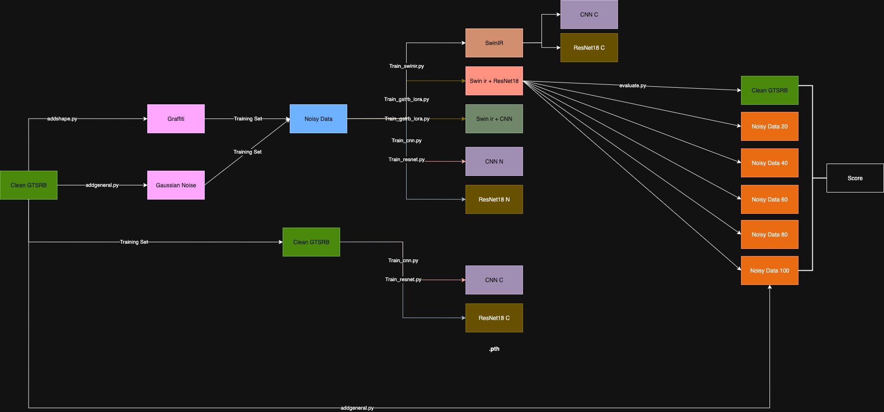

# Road Sign Classification with Denoising Pipeline Approach
[Yu Letian](https://github.com/FisherSkyi), Sun Yuqi, Zhang Jiaqi

[email of author](yuletian@u.nus.edu)

---

This repository is the PyTorch implementation of our idea: *Road Sign Classification with Denoising Pipeline Approach*

#### Contents
1. [Structure](#Structure)
1. [Dataset](#Dataset)
1. [Training](#Training)
1. [Testing](#Testing)
1. [Results](#Results)
1. [Citation](#Citation)
1. [License and Acknowledgement](#License-and-Acknowledgement)
### Structure

### Dataset
```text
# Directory structure of the dataset
GTSRB/
  ├── train/
  │    ├── 00000/
  │    │    ├── 00000_00000.ppm
  │    │    ├── 00000_00001.ppm
  │    │    ├── ...
  │    │    └── GT-00000.csv
  │    ├── 00001/
  │    ├── ...
  │    ├── 00042/
  │    └── Readme-Images.txt
  ├── test/
  │    ├── Images/
  │    │    ├── 00000.ppm
  │    │    ├── 00001.ppm
  │    │    └── ...
  │    └── GT-final_test.csv
```


### License-and-Acknowledgement

This repository is licensed under the [Apache License 2.0](LICENSE).  

It includes code from [SwinIR](https://github.com/JingyunLiang/SwinIR), which is also licensed under the Apache License 2.0. Please also follow their licenses. 

It includes code from [LoRA](https://github.com/microsoft/LoRA#), which is licensed under the MIT License and adopts the Microsoft Open Source Code of Conduct. Please also follow their licenses. 

It contains code for training and testing models on the [GTSRB dataset](https://benchmark.ini.rub.de/gtsrb_news.html).
(J. Stallkamp, M. Schlipsing, J. Salmen, and C. Igel. The German Traffic Sign Recognition Benchmark: A multi-class classification competition. In Proceedings of the IEEE International Joint Conference on Neural Networks, pages 1453–1460. 2011.) 

Thanks for their awesome works.


